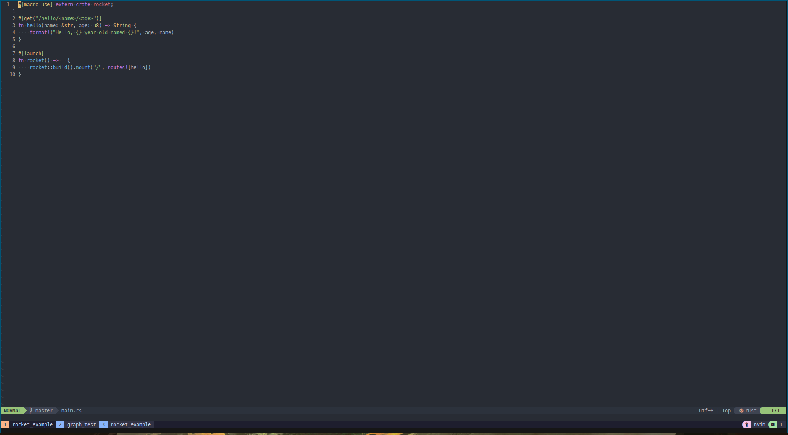

# dotfiles

This repository is meant to hold my personal configuration of shell, editor and command line applications as backup. With recent use of various 'IDE's in combination with VMs, I've been plagued with High resource usage killing my machine. I've opted to search for alternative solutions for my development work flow and as such I can accross NeoVim + Tmux as a replacement for an 'IDE'. Please note that this is my preference for my terminal and editor application.

The configuration within this project is typically held within *~/.config*. 


## NeoVim

NeoVim with additional configuration for mapping keys for window splitting, file navigation, rich plugin environment and Lua support. The config can be found in the `nvim` directory and predominantly is made up of *Vim Script*; *Ruby*; and *Lua* files. Where the main configuration file is *init.lua* and now completely removed the legacy *Vim Script* configuration. Personnaly I prefer *Vim Script* for simple file type and autocommands are configured, whereas *Lua* is for suitable for configuring various plugins where options and settings run multiple layers deep. I also added so plugin specific *Lua* config files.
```
init.lua
lua/
├── diagnostics.lua
├── filetype.lua
├── mappings.lua
├── options.lua
├── plugins
│   ├── cmp.lua
│   ├── conform.lua
│   ├── harpoon.lua
│   ├── lspconfig.lua
│   ├── lualine.lua
│   ├── rustaceanvim.lua
│   ├── rust-tools.lua
│   └── telescope.lua
├── plug.lua
├── semantic_highlights.lua
└── theme.lua
```
### Theme

The prefered `theme` here is [OneDark](https://github.com/navarasu/onedark.nvim "Atom One Dark Theme") with the `darker` style set.




NeoVim plug-ins are managed by Vim Plug and the following list of plug-ins are used:
- lspsaga.nvim
- cmp-path
- vimwiki
- lualine.nvim
- telescope.nvim
- vim-tmux-navigator
- nvim-treesitter
- harpoon
- vim-log-highlighting
- vim-auto-save
- nvim-cmp
- vim-slim
- nvim-web-devicons
- vim-css-color
- vim-toml
- plenary.nvim
- rust.vim
- cmp-vsnip
- rustaceanvim
- nvim-lspconfig
- catppuccin
- conform.nvim
- vim-node
- vim-gitgutter
- onedark.vim
- vim-vsnip
- cmp-nvim-lsp


*Note:* LSP config used here is only the editor configuration used by NeoVim, in order to use the LSP functionality each individual LSP needs to be installed on the user system. In my case I have `rust-analyzer`, `lua_ls`, `clangd` and `pylsp` installed.
